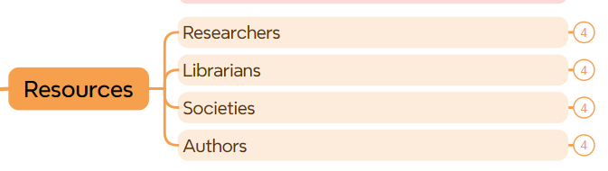

# Wiley-Assignement-02
This assignement contains the automation test scripts for https://onlinelibrary.wiley.com/

It contains four major sections namely Header, Resources, Subjects and Footer

Link to diagram - https://drive.google.com/file/d/1ushK_6z8nERYodJUvqwqgGDz649XNZDu/view?usp=sharing 

# Header

# Resources

# Subjects

# Footer

